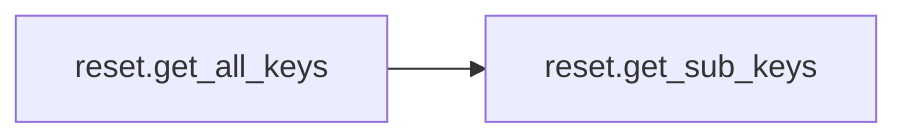
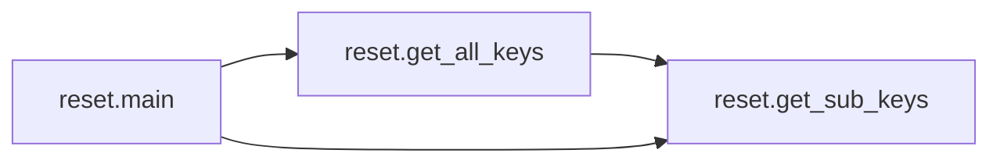

# Key Objects

[_Documentation generated by Documatic_](https://www.documatic.com)

<!---Documatic-section-reset.get_all_keys-start--->
## reset.get_all_keys

<!---Documatic-section-get_all_keys-start--->


### Object Calls

* reset.get_sub_keys

<!---Documatic-block-reset.get_all_keys-start--->
<details>
	<summary><code>reset.get_all_keys</code> code snippet</summary>

```python
def get_all_keys(root: Any, key_path: str) -> list:
    all_keys_list: list = list()
    qeque = deque()
    qeque.append(key_path)
    while len(qeque) != 0:
        sub_key_path = qeque.popleft()
        for item in get_sub_keys(root, sub_key_path):
            item_path = os.path.join(sub_key_path, item)
            if len(get_sub_keys(root, item_path)) != 0:
                qeque.append(item_path)
                all_keys_list.append(item_path)
            else:
                all_keys_list.append(item_path)
    return all_keys_list
```
</details>
<!---Documatic-block-reset.get_all_keys-end--->
<!---Documatic-section-get_all_keys-end--->

# #
<!---Documatic-section-reset.get_all_keys-end--->

<!---Documatic-section-reset.get_sub_keys-start--->
## reset.get_sub_keys

<!---Documatic-section-get_sub_keys-start--->
<!---Documatic-block-reset.get_sub_keys-start--->
<details>
	<summary><code>reset.get_sub_keys</code> code snippet</summary>

```python
def get_sub_keys(root: Any, reg_path: str) -> list:
    key_result = winreg.OpenKeyEx(root, reg_path)
    i: int = 0
    sub_keys_list: list = list()
    while True:
        try:
            sub_keys = winreg.EnumKey(key_result, i)
            sub_keys_list.append(sub_keys)
            i += 1
        except Exception as e:
            break
    return sub_keys_list
```
</details>
<!---Documatic-block-reset.get_sub_keys-end--->
<!---Documatic-section-get_sub_keys-end--->

# #
<!---Documatic-section-reset.get_sub_keys-end--->

<!---Documatic-section-reset.main-start--->
## reset.main

<!---Documatic-section-main-start--->


### Object Calls

* reset.get_all_keys
* reset.get_sub_keys

<!---Documatic-block-reset.main-start--->
<details>
	<summary><code>reset.main</code> code snippet</summary>

```python
def main():
    clsid_all_keys_list = get_all_keys(HKEY_CURRENT_USER, CLSID_PATH)
    premium_all_keys_list = get_all_keys(HKEY_CURRENT_USER, PREMIUM_PATH)
    premium_sub_keys_list = [os.path.join(PREMIUM_PATH, item) for item in get_sub_keys(HKEY_CURRENT_USER, PREMIUM_PATH)]
    print(f'premium_sub_keys_list: {premium_sub_keys_list}')
    for clsid_item in clsid_all_keys_list:
        if 'Info' in clsid_item:
            clsid_item_prefix = os.path.dirname(clsid_item)
            print(f'# Info item: {clsid_item}')
            winreg.DeleteKeyEx(HKEY_CURRENT_USER, clsid_item)
            winreg.DeleteKeyEx(HKEY_CURRENT_USER, clsid_item_prefix)
    for premium_item in reversed(premium_all_keys_list):
        if 'Servers' in premium_item:
            print(f'Tips: Servers => {premium_item} will not be deleted.')
            pass
        elif premium_item in premium_sub_keys_list:
            print(f'Tips: Servers => {premium_item} will not be deleted.')
            pass
        else:
            winreg.DeleteKeyEx(HKEY_CURRENT_USER, premium_item)
```
</details>
<!---Documatic-block-reset.main-end--->
<!---Documatic-section-main-end--->

# #
<!---Documatic-section-reset.main-end--->

[_Documentation generated by Documatic_](https://www.documatic.com)